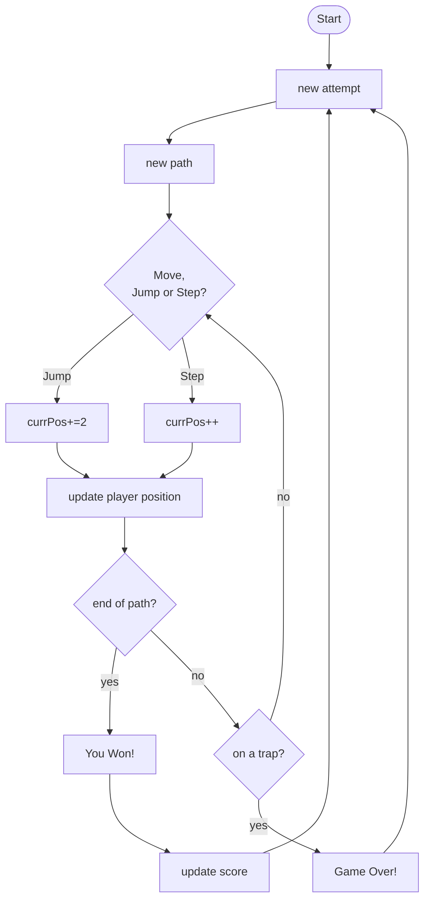

# Labyrinth - Escape
Assignments - 02
## Brief:
Choose a “mini-game” to rebuild with HTML, CSS and JavaScript. The requirements are:
- The webpage should be responsive
- Choose an avatar at the beginning of the game
- Keep track of the score of the player
- Use the keyboard to control the game (indicate what are the controls in the page). You can also use buttons (mouse), but also keyboard.
- Use some multimedia files (audio, video, …)
- Implement an “automatic restart” in the game (that is not done via the refresh of the page)
## Project Description
The Maze Escape mini-game is inspired by classic grid-based labyrinth challenges, where the player must navigate through a randomly generated maze and reach a designated exit point. The labyrinth is created from a 7×7 grid made of empty spaces and solid walls that block the player’s path. At each new attempt, the configuration of the maze changes, so the player never faces the same layout twice.
In this project, the player controls an avatar that can be moved using the keyboard arrow keys.
Each press of an arrow key moves the character by one cell in the corresponding direction, as long as the move does not collide with a wall or leave the boundaries of the grid. Every movement also plays a short sound effect, providing responsive feedback to the player's actions.
The goal is to reach the exit positioned at the bottom-right corner of the grid.
If the player successfully reaches the exit, a victory sound plays, the score increases by one, and a new maze is immediately generated, placing the player again at the starting point for a fresh attempt.
Because the maze layout is randomized every time, the player cannot predict the correct path in advance and must adapt to the changing structure of the labyrinth.
## Screenshot

## Flow Chart:

#### Choose color: 

#### Change size: 

#### Add: 

#### Remove: 

#### Switch View: 

