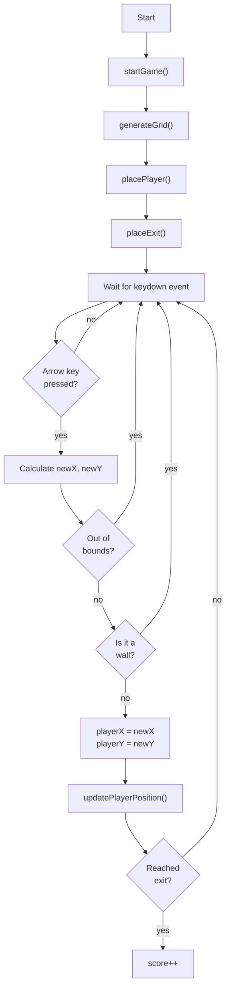

<<<<<<< HEAD
# Github repository
Assignments - 01 
## Brief:
Starting from the concept of a pinboard, implement a web page that:
- is responsive (properly layout for smartphone, tablet, and desktop)
- allows the user to add and remove elements
- allows the user to coustomize elements (i.e. colors, size)
- allows the switch between two views (at least)

## Screenshot
### Grid View

### List View

### Project Description
My project is a bulletin board where you write post-it notes or reminders. You can choose between three post-it sizes: small, medium and large, you can choose the color. The text inside is formatted according to the choice of version. You can put and remove post-it notes and decide to change from a grid view or a list view.

## Functions:

#### Choose color: 
It allows the user to change the color of the post-it by clicking a button that opens a colorimeter spectrum.

#### Change size: 
Allows the user to choose the post-it size between small, medium or large.

#### Add: 
After choosing size and color, by pressing add, the post-it will appear on the bulletin board.

#### Remove: 
By clicking on the red button at the top right of the post-it note, this will be removed from the bulletin board.

#### Switch View: 
By clicking on switch view the user can choose whether to use a grid view or a list view.
=======
# Labyrinth - Escape
Assignments - 02
## Brief:
Choose a “mini-game” to rebuild with HTML, CSS and JavaScript. The requirements are:
- The webpage should be responsive
- Choose an avatar at the beginning of the game
- Keep track of the score of the player
- Use the keyboard to control the game (indicate what are the controls in the page). You can also use buttons (mouse), but also keyboard.
- Use some multimedia files (audio, video, …)
- Implement an “automatic restart” in the game (that is not done via the refresh of the page)
## Project Description
The Maze Escape mini-game is inspired by classic grid-based labyrinth challenges, where the player must navigate through a randomly generated maze and reach a designated exit point. The labyrinth is created from a 7×7 grid made of empty spaces and solid walls that block the player’s path. At each new attempt, the configuration of the maze changes, so the player never faces the same layout twice.
In this project, the player controls an avatar that can be moved using the keyboard arrow keys.
Each press of an arrow key moves the character by one cell in the corresponding direction, as long as the move does not collide with a wall or leave the boundaries of the grid. Every movement also plays a short sound effect, providing responsive feedback to the player's actions.
The goal is to reach the exit positioned at the bottom-right corner of the grid.
If the player successfully reaches the exit, a victory sound plays, the score increases by one, and a new maze is immediately generated, placing the player again at the starting point for a fresh attempt.
Because the maze layout is randomized every time, the player cannot predict the correct path in advance and must adapt to the changing structure of the labyrinth.
## Screenshot

## Flow Chart:

## Function list:
### function startGame()
Purpose: Initialize the game or restart it after a win.
What it does:
Gets the board DOM element. Clears the board content.
Sets CSS grid layout to 7×7.
Displays the current score.
Calls:
generateGrid() to create the maze layout.
placePlayer() to place the player at (0,0).
placeExit() to place the exit at (6,6).
This function resets the maze but does not reset the score.
It completely recreates the board each time.

### function generateGrid()
Purpose: Create the visual cells and generate the internal grid data.
Process:
Reset the grid array.
Loop through every row (y) and column (x).
Create a 
 for each cell and add the cell class.
Randomly decide if the cell is a wall (25% chance).
Force start (0,0) and end (6,6) to stay free.
Add class "wall" and push 1 in grid if it is a wall, otherwise push 0.
Append each cell to the board.

### function placePlayer()
Purpose: Create and position the player character.
Steps:
Create a 
 with id "player".
Set its content to the selected avatar (#avatarPicker value).
Append it to the board.
Set player coordinates to (0,0).
Call updatePlayerPosition() to place it visually.
Because startGame() clears the board, this function safely creates a new player every time.

### function updatePlayerPosition()
Purpose: Convert grid coordinates into pixel positions and size.
What it does:
Compute the pixel size of a cell.
Set the player's width and height.
Use left and top CSS values to place the player.
If the window or board size changes, the player’s position will not automatically update unless you call this function again (for example on a window resize event).

### function placeExit() and function updateExitPosition()
Purpose: Create and visually position the exit tile.
placeExit():
Creates the exit 
.
Appends it to the board.
Calls updateExitPosition().
updateExitPosition():
Computes exit size and position.
Places it at (size-1, size-1) → bottom-right corner.

### Keyboard Listener: document.addEventListener("keydown", ...)
Purpose: Handle player movement.
Behavior:
Ignore input if the board isn’t ready.
Make a temporary copy of the player's coordinates.
Update the temp coordinates depending on the arrow key pressed.
Validate movement:
reject moves outside the board,
reject moves into walls.
If valid:
update playerX, playerY,
call updatePlayerPosition() to move the player,
play movement sound,
call checkWin() to check if the exit is reached.
Holding down arrow keys triggers repeated movement (browser default).
You may add e.preventDefault() to avoid scrolling.

### function playMoveSound() and playWinSound()
Purpose: Play the movement and victory sounds.
Behavior:
Reset the audio to the beginning (currentTime = 0).
Play the sound.

### function checkWin()
Purpose: Determine if the player reached the exit and trigger a level restart.
When the player reaches (size-1, size-1):
Play the win sound.
Increase the score.
Update the on-screen score.
Create a "YOU WIN!!" message and add it to the document body.
Call startGame() immediately.
Also set a timeout:
remove win message after 1 second,
call startGame() again.
>>>>>>> 9d514da115b8e70d43c4550617edfeb550267004
