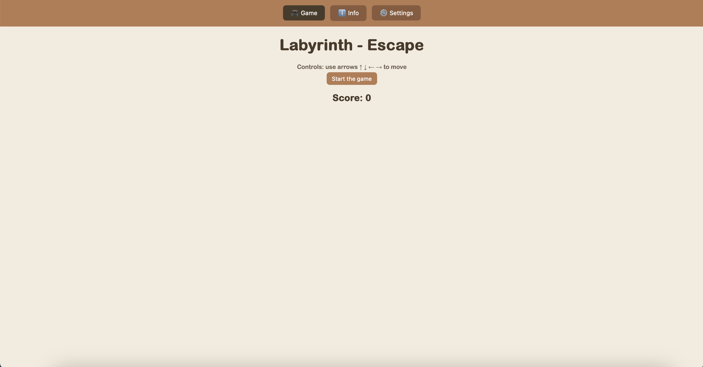
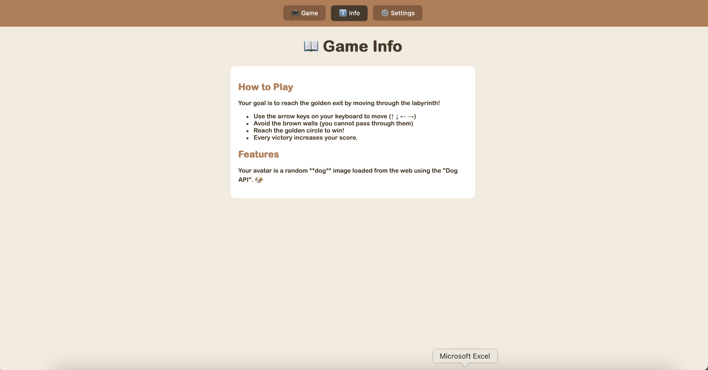
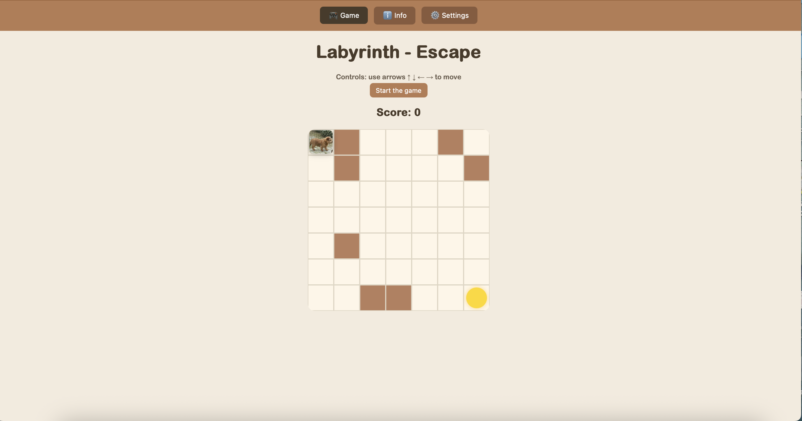
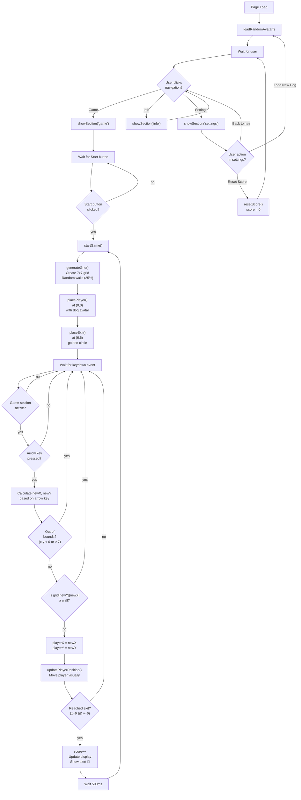

# Github repository
Assignments - 03
# Labyrinth - Escape
Assignments - 03
## Brief:
Upgrade the Assignment 02 by adding the use of data coming from an external web API. For example, fetch contents (audio, images, video, text, metadata) from online archives, AI generated contents (chatGPT API), data (weather, realtime traffic data, environmental data).
The application must have those requirements:
- The webpage is responsive
- Use a web API (you choose which one best fists for your project) to load the data and display them in the webpage
- At least one multimedia file (for user feedback interactions, or content itself)
- Develop a navigation system that allows the user to navigate different sections with related content and functionalities
## Project Description
The Maze Escape is a 7×7 grid-based mini-game where the player must reach the exit while avoiding randomly generated walls. The player’s avatar is loaded through the Dog API, making each run unique. Movement uses the arrow keys with sound feedback. Reaching the exit triggers a victory sound, increases the score, and instantly generates a new, unpredictable maze.
## Screenshot

## Flow Chart:

## Function list:
### function startGame()
Purpose: Initialize the game or restart it after a win.
What it does:
Gets the board DOM element. Clears the board content.
Sets CSS grid layout to 7×7.
Displays the current score.
Calls:
generateGrid() to create the maze layout.
placePlayer() to place the player at (0,0).
placeExit() to place the exit at (6,6).
This function resets the maze but does not reset the score.
It completely recreates the board each time.

### function generateGrid()
Purpose: Create the visual cells and generate the internal grid data.
Process:
Reset the grid array.
Loop through every row (y) and column (x).
Create a 
 for each cell and add the cell class.
Randomly decide if the cell is a wall (25% chance).
Force start (0,0) and end (6,6) to stay free.
Add class "wall" and push 1 in grid if it is a wall, otherwise push 0.
Append each cell to the board.

### function placePlayer()
Purpose: Create and position the player character.
Steps:
Create a 
 with id "player".
Set its content to the selected avatar (#avatarPicker value).
Append it to the board.
Set player coordinates to (0,0).
Call updatePlayerPosition() to place it visually.
Because startGame() clears the board, this function safely creates a new player every time.

### function updatePlayerPosition()
Purpose: Convert grid coordinates into pixel positions and size.
What it does:
Compute the pixel size of a cell.
Set the player's width and height.
Use left and top CSS values to place the player.
If the window or board size changes, the player’s position will not automatically update unless you call this function again (for example on a window resize event).

### function placeExit() and function updateExitPosition()
Purpose: Create and visually position the exit tile.
placeExit():
Creates the exit 
.
Appends it to the board.
Calls updateExitPosition().
updateExitPosition():
Computes exit size and position.
Places it at (size-1, size-1) → bottom-right corner.

### Keyboard Listener: document.addEventListener("keydown", ...)
Purpose: Handle player movement.
Behavior:
Ignore input if the board isn’t ready.
Make a temporary copy of the player's coordinates.
Update the temp coordinates depending on the arrow key pressed.
Validate movement:
reject moves outside the board,
reject moves into walls.
If valid:
update playerX, playerY,
call updatePlayerPosition() to move the player,
play movement sound,
call checkWin() to check if the exit is reached.
Holding down arrow keys triggers repeated movement (browser default).
You may add e.preventDefault() to avoid scrolling.

### function playMoveSound() and playWinSound()
Purpose: Play the movement and victory sounds.
Behavior:
Reset the audio to the beginning (currentTime = 0).
Play the sound.

### function checkWin()
Purpose: Determine if the player reached the exit and trigger a level restart.
When the player reaches (size-1, size-1):
Play the win sound.
Increase the score.
Update the on-screen score.
Create a "YOU WIN!!" message and add it to the document body.
Call startGame() immediately.
Also set a timeout:
remove win message after 1 second,
call startGame() again.
>>>>>>> 9d514da115b8e70d43c4550617edfeb550267004
